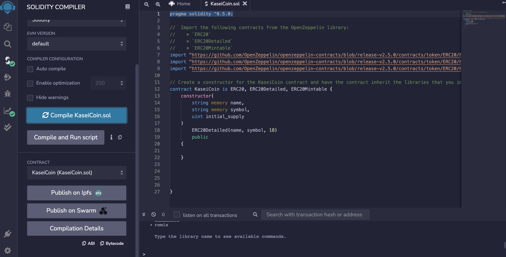
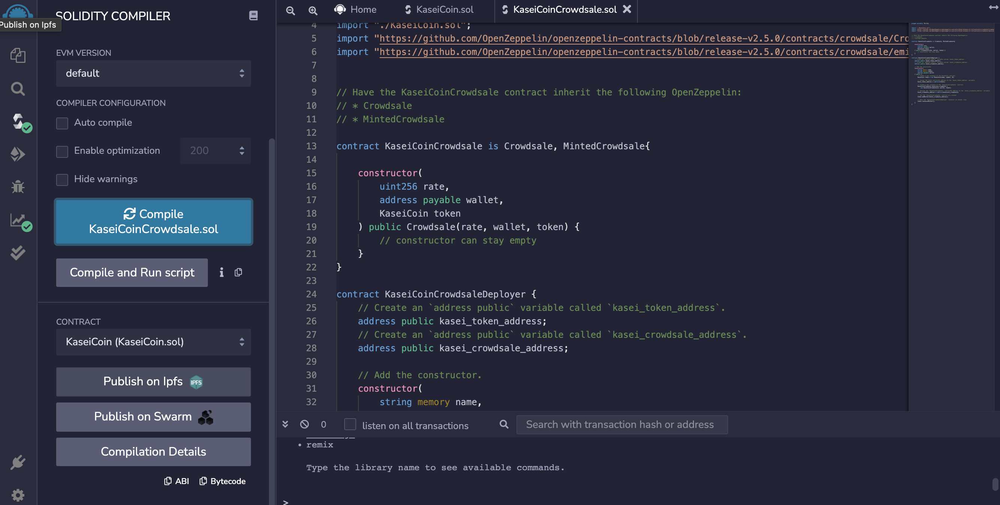
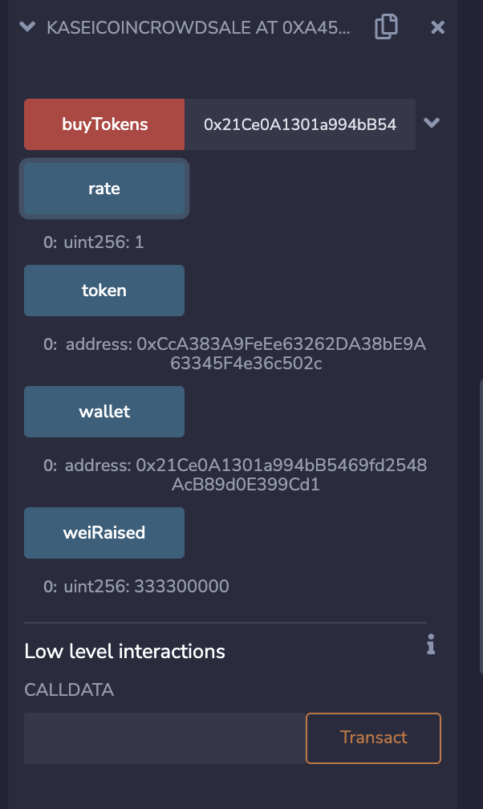
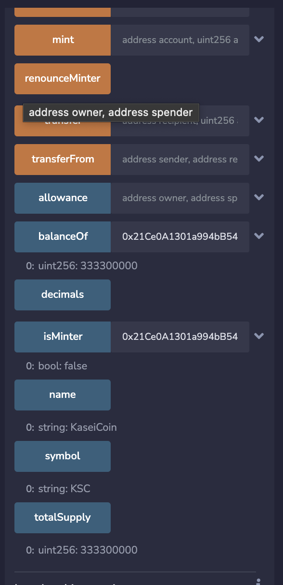

# Advanced-Solidity
Unit 21: Martian Token Crowdsale

## Background:
After waiting for years and passing several tests, the Martian Aerospace Agency selected you to become part of the first human colony on Mars. As a prominent fintech professional, they chose me to lead a project developing a monetary system for the new Mars colony. I have decided to base this new system on blockchain technology and to define a new cryptocurrency named KaseiCoin. (Kasei means Mars in Japanese.)

KaseiCoin will be a fungible token that’s ERC-20 compliant. You’ll launch a crowdsale that will allow people who are moving to Mars to convert their earthling money to KaseiCoin.

## Evaluation Evidence:

Successful compilation of the KaseiCoin Token contract:

Successful compilation of the KaseiCoin Crowdsale contract:

Deploying CrowdSale Deployer:

Deploying KaseiCoin contract:

Deploying KaseiCoin Crowdsale contract:

Testing the functionality of the crowdsale by using test account to buy new tokens and then checking the balances of those accounts:

Reviewing the total supply of minted tokens and the amount of wei that the crowdsale contract has raised:

